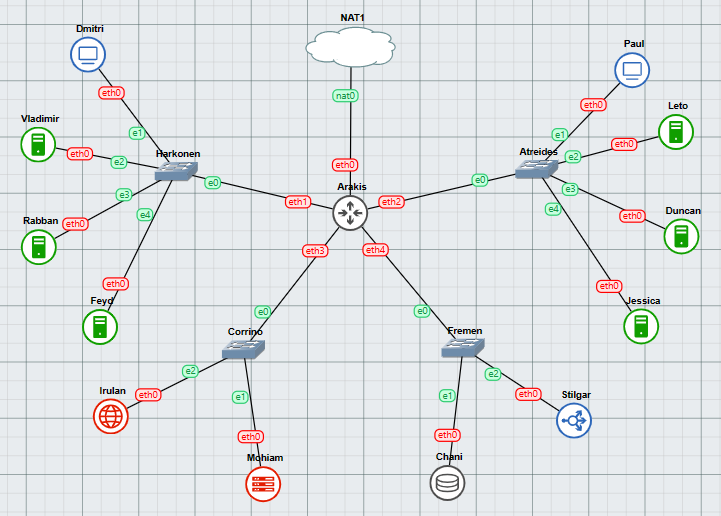

# Praktikum Modul 3 Jaringan Komputer

Praktikum Modul 3 Jaringan Komputer - **IT-03**

## Authors

| Nama                                                | NRP        |
| --------------------------------------------------- | ---------- |
| [Sighra Attariq Sumere Jati](https://www.github.com/sgraa) | 5027221068 |
| [Wilson Matthew Thendry](https://www.github.com/waifuwetdream) | 5027221024 |

### Peta Spice
[Spice Map](https://its.id/m/SpiceMapIT03)


## Daftar isi
- [Topology](#topology)
- [Configuration](#Config)
- [Nomor 1](#nomor-1)
- [Nomor 2](#nomor-2)
- [Nomor 3](#nomor-3)
- [Nomor 4](#nomor-4)
- [Nomor 5](#nomor-5)
- [Nomor 6](#nomor-6)
- [Nomor 7](#nomor-7)
- [Nomor 8](#nomor-8)
- [Nomor 9](#nomor-9)
- [Nomor 10](#nomor-10)
- [Nomor 11](#nomor-11)
- [Nomor 12](#nomor-12)
- [Nomor 13](#nomor-13)
- [Nomor 14](#nomor-14)
- [Nomor 15](#nomor-15)
- [Nomor 16](#nomor-16)
- [Nomor 17](#nomor-17)
- [Nomor 18](#nomor-18)
- [Nomor 19](#nomor-19)
- [Nomor 20](#nomor-20)

# Topology

<div align="center">
    
</div>  

# Config
- Arrakis (DHCP Relay)
```bash
auto eth0
iface eth0 inet dhcp
up iptables -t nat -A POSTROUTING -o eth0 -j MASQUERADE -s 10.65.0.0/16

auto eth1
iface eth1 inet static
address 10.65.1.0
netmask 255.255.255.0

auto eth2
iface eth2 inet static
address 10.65.2.0
netmask 255.255.255.0

auto eth3
iface eth3 inet static
address 10.65.3.0
netmask 255.255.255.0

auto eth4
iface eth4 inet static
address 10.65.4.0
netmask 255.255.255.0
```
- Mohiam (DHCP Server)
```bash
auto eth0
iface eth0 inet static
address 10.65.3.1
netmask 255.255.255.0
gateway 10.65.3.0
```
- Irulan (DNS Server)
```bash
auto eth0
iface eth0 inet static
address 10.65.3.2
netmask 255.255.255.0
gateway 10.65.3.0
```
- Chani (Database Server)
```bash
auto eth0
iface eth0 inet static
address 10.65.4.1
netmask 255.255.255.0
gateway 10.65.4.0
```
- Stilgar (Load Balancer)
```bash
auto eth0
iface eth0 inet static
address 10.65.4.2
netmask 255.255.255.0
gateway 10.65.4.0
```
- Vladimir (PHP Worker)
```bash
auto eth0
iface eth0 inet static
address 10.65.1.2
netmask 255.255.255.0
gateway 10.65.1.0
```
- Rabban (PHP Worker)
```bash
auto eth0
iface eth0 inet static
address 10.65.1.3
netmask 255.255.255.0
gateway 10.65.1.0
```
- Feyd (PHP Worker)
```bash
auto eth0
iface eth0 inet static
address 10.65.1.3
netmask 255.255.255.0
gateway 10.65.1.0
```
- Leto (Laravel Worker)
```bash
auto eth0
iface eth0 inet static
address 10.65.2.2
netmask 255.255.255.0
gateway 10.65.2.0
```
- Duncan (Laravel Worker)
```bash
auto eth0
iface eth0 inet static
address 10.65.2.3
netmask 255.255.255.0
gateway 10.65.2.0
```
- Jessica (Laravel Worker)
```bash
auto eth0
iface eth0 inet static
address 10.65.2.4
netmask 255.255.255.0
gateway 10.65.2.0
```
- Paul (Client)
```bash
auto eth0
iface eth0 inet dhcp
```
- Dmitri (Fixed Client)
```bash
auto eth0
iface eth0 inet dhcp
hwaddress ether 92:6a:4b:8f:b3:cf
```

### Bash Files
- Arrakis (DHCP Relay)
```bash
apt-get update
apt-get install isc-dhcp-relay -y
```
- Mohiam (DHCP Server)
```bash
echo nameserver 192.168.122.1 > /etc/resolv.conf
apt-get update
apt-get install isc-dhcp-server -y
dhcpd --version

echo INTERFACES="eth0" > /etc/default/isc-dhcp-serverm
```
- Irulan (DNS Server)
```bash
echo nameserver 192.168.122.1 > /etc/resolv.conf
apt-get update
apt-get install bind9 -y
```
- Chani (Database Server)
```bash
echo nameserver 192.168.122.1 > /etc/resolv.conf

apt-get update
apt-get install mariadb-server -y
service mysql start
```
- Stilgar (Load Balancer)
```bash
echo nameserver 192.168.122.1 > /etc/resolv.conf

apt-get update
apt-get install apache2-utils php7.3 php-fpm -y
apt-get install nginx -y
apt-get install lynx -y
```
- Vladimir, Rabban, Feyd (PHP Worker)
```bash
echo nameserver 10.65.3.2 > /etc/resolv.conf

apt-get update
apt-get install nginx -y
apt-get install lynx -y
apt-get install php php-fpm -y
apt-get install wget -y
apt-get install unzip -y
service nginx start
service php7.3-fpm start

wget -O '/var/www/harkonen.it03.com' 'https://docs.google.com/uc?export=download&id=1lmnXJUbyx1JDt2OA5z_1dEowxozfkn30'
unzip -o /var/www/harkonen.it03.com -d /var/www/
rm /var/www/harkonen.it03.com
mv /var/www/modul-3 /var/www/harkonen.it03.com
```
- Leto, Duncan, Jessica (Laravel Worker)
```bash
echo nameserver 192.168.122.1 > /etc/resolv.conf

apt-get update
apt-get install mariadb-client -y
apt-get install lynx -y
apt-get install -y lsb-release ca-certificates apt-transport-https software-properties-common gnupg2
curl -sSLo /usr/share/keyrings/deb.sury.org-php.gpg https://packages.sury.org/php/apt.gpg
sh -c 'echo "deb [signed-by=/usr/share/keyrings/deb.sury.org-php.gpg] https://packages.sury.org/php/ $(lsb_release -sc) main" > /etc/apt/sources.li$apt-get update
apt-get install php8.0-mbstring php8.0-xml php8.0-cli php8.0-common php8.0-intl php8.0-opcache php8.0-readline php8.0-mysql php8.0-fpm php8.0-curl $apt-get install nginx -y
wget https://getcomposer.org/download/2.0.13/composer.phar
chmod +x composer.phar
mv composer.phar /usr/bin/composer
apt-get install git -y
git clone https://github.com/martuafernando/laravel-praktikum-jarkom /var/www/laravel-praktikum-jarkom
composer update
composer install
```

# Nomor 1
Ikuti dan bentuk `Peta Spice` sesuai dengan topologi yang telah diberikan.


Buat zone domain di node `Irulan` untuk `atreides.it03.com` yang mengarah ke IP Leto (Laravel Worker) dan juga `harkonen.it03.com` yang mengarah IP Vladimir (PHP Worker).

Gunakan script dibawah ini:

### Irulan.sh
```bash
echo 'zone "atreides.it03.com" {
        type master;
        file "/etc/bind/jarkom/atreides.it03.com";
};

zone "harkonen.it03.com" {
        type master;
        file "/etc/bind/jarkom/harkonen.it03.com";
};' > /etc/bind/named.conf.local

mkdir /etc/bind/jarkom

echo ';
; BIND data file for local loopback interface
;
$TTL    604800
@       IN      SOA     atreides.it03.com. root.atreides.it03.com. (
                        2024051601      ; Serial
                        604800          ; Refresh
                        86400           ; Retry
                        2419200         ; Expire
                        604800 )        ; Negative Cache TTL
;
@               IN      NS      atreides.it03.com.
@               IN      A       10.65.2.2 ; IP Leto Laravel Workerr' > /etc/bind/jarkom/atreides.it03.com

echo ';
; BIND data file for local loopback interface
;
$TTL    604800
@       IN      SOA     harkonen.it03.com.  harkonen.it03.com.  (
                        2024051601      ; Serial
                        604800          ; Refresh
                        86400           ; Retry
                        2419200         ; Expire
                        604800 )        ; Negative Cache TTL
;
@               IN      NS      harkonen.it03.com.
@               IN      A       10.65.1.2 ; IP Vladimir PHP Worker' > /etc/bind/jarkom/harkonen.it03.com

echo 'options {
        directory "/var/cache/bind";

        forwarders {
                192.168.122.1;
        };

        // dnssec-validation auto;
        allow-query{any;};
        auth-nxdomain no;    # conform to RFC1035
        listen-on-v6 { any; };
}; ' >/etc/bind/named.conf.options

service bind9 restart
```
### Bentuk Hasil Nomor 1
<div align="center">


</div>

# Nomor 2
Semua CLIENT harus menggunakan konfigurasi dari DHCP Server. 

Client yang melalui **House Harkonen** mendapat range IP dari [prefix IP].1.14 - [prefix IP].1.28 dan [prefix IP].1.49 - [prefix IP].1.70.

Jalankan script dibawah ini untuk menjadikan `Arrakis` sebagai `DHCP Relay`

### Arrakis.sh
```bash
apt-get update
apt-get install isc-dhcp-relay -y
service isc-dhcp-relay start

relay="SERVERS=\"10.65.3.1\" 
INTERFACES=\"eth1 eth2 eth3 eth4\"
OPTIONS=\"\"
"
echo "$relay" > /etc/default/isc-dhcp-relay

echo net.ipv4.ip_forward=1 > /etc/sysctl.conf

service isc-dhcp-relay restart
```
Setelah menjalankan script diatas, tambahkan script di `Mohiam` sebagai `DHCP Server` (untuk bagian nomor 2)

### Mohiam.sh
```bash
subnet 10.65.1.0 netmask 255.255.255.0 {
    range 10.65.1.14 10.65.1.28;
    range 10.65.1.49 10.65.1.70;
    option routers 10.65.1.0;
    option broadcast-address 10.65.1.255;
    default-lease-time 300;
    max-lease-time 5220;
}
```

# Nomor 3
Client yang melalui **House Atreides** mendapatkan range IP dari [prefix IP].2.15 - [prefix IP].2.25 dan [prefix IP].2 .200 - [prefix IP].2.210.

Tambahkan script ke dalam `Mohiam` agar client dari **House Atreides** mendapatkan IPnya.

### Mohiam.sh
```bash
subnet 10.65.2.0 netmask 255.255.255.0 {
    range 10.65.2.15 10.65.2.25;
    range 10.65.2.200 10.65.2.210;
    option routers 10.65.2.0;
    option broadcast-address 10.65.2.255;
    default-lease-time 1200;
    max-lease-time 5220;
}
```

# Nomor 4
Ubah script yang sudah ada di dalam `Mohiam` agar client dapat diarahkan ke IP DNS Server `Irulan`.

### Mohiam.sh
```bash
subnet 10.65.1.0 netmask 255.255.255.0 {
    range 10.65.1.14 10.65.1.28;
    range 10.65.1.49 10.65.1.70;
    option routers 10.65.1.0;
    option broadcast-address 10.65.1.255;
    option domain-name-servers 10.65.3.2; #Gunakan IP Irulan
}

subnet 10.65.2.0 netmask 255.255.255.0 {
    range 10.65.2.15 10.65.2.25;
    range 10.65.2.200 10.65.2.210;
    option routers 10.65.2.0;
    option broadcast-address 10.65.2.255;
    option domain-name-servers 10.65.3.2; #IP Irulan
}
```

Tambahkan juga script dibawah ini ke **Princess Irulan** yang akan membantu client `Dmitri` dan `Paul` agar dapat terhubung ke internet. 

### Irulan.sh
```bash
echo 'options {
        directory "/var/cache/bind";

        forwarders {
                192.168.122.1;
        };

        // dnssec-validation auto;
        allow-query{any;};
        auth-nxdomain no;    # conform to RFC1035
        listen-on-v6 { any; };
}; ' >/etc/bind/named.conf.options
```

Coba ping `google.com` atau `harkonen.it03.com` dan `atreides.it03.com`.

# Nomor 5
Durasi DHCP server meminjamkan alamat IP kepada Client yang melalui **House Harkonen** selama 5 menit sedangkan pada client yang melalui **House Atreides** selama 20 menit. Dengan waktu maksimal dialokasikan untuk peminjaman alamat IP selama 87 menit.

Tambahkan script dibawah ini ke dalam `Mohiam` untuk mengatur waktu peminjaman IP dari server ke client.

### Mohiam.sh
```bash
subnet 10.65.1.0 netmask 255.255.255.0 {
    range 10.65.1.14 10.65.1.28;
    range 10.65.1.49 10.65.1.70;
    option routers 10.65.1.0;
    option broadcast-address 10.65.1.255;
    option domain-name-servers 10.65.3.2;
    default-lease-time 300; #5 Menit Peminjman
    max-lease-time 5220; #Waktu Maksimal 87 Menit
}

subnet 10.65.2.0 netmask 255.255.255.0 {
    range 10.65.2.15 10.65.2.25;
    range 10.65.2.200 10.65.2.210;
    option routers 10.65.2.0;
    option broadcast-address 10.65.2.255;
    option domain-name-servers 10.65.3.2;
    default-lease-time 1200; #20 Menit Peminjaman
    max-lease-time 5220; #Waktu Maksimal 87 Menit
}
```

### Bentuk Hasil No 2-5
<div align="center">

 
</div>


